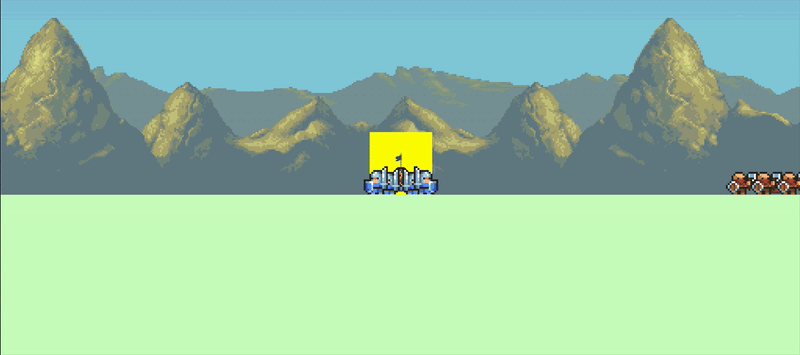

# About WARPPC
Warppc (project name) is a 2D multiplayer game written in Rust and using the [Bevy](https://bevyengine.org/) engine.
We are currently programming our [MVP](https://github.com/glklimmer/warppcs/milestone/1), so stay tuned !

## Game Loop
Our planned game loop consist of:
- Slay NPCs to gather loot
- Upgrade your base and recruit stronger units
- Send message carriers to communicate with other players
- Intercept message carriers to manipulate the messages
- Win by destroying other player's bases
